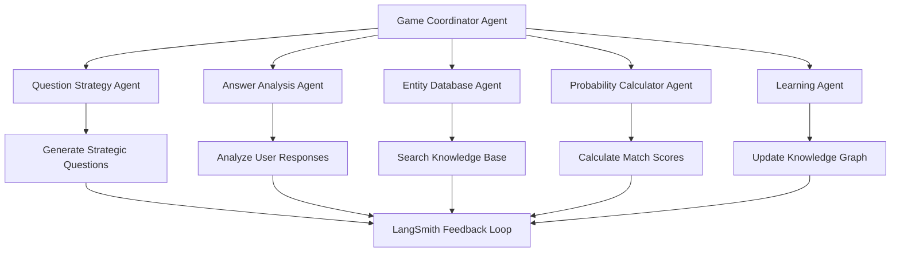

# AI Akinator - "The Genius" Guessing Game
## Multi-Agent LangGraph Implementation with LangSmith Learning


---

## 🎯 Project Overview

**AI Akinator** is an intelligent guessing game powered by LangGraph multi-agent system that:
- Asks strategic questions to narrow down possibilities
- Learns from every game session using LangSmith
- Adapts questioning strategy based on user responses
- Maintains a knowledge graph of entities and their attributes
- Gets smarter over time through continuous learning

### Why This Project is Perfect for Your Skills

✅ **Uses Your Multi-Agent Pattern**: Question Generator, Answer Analyzer, Decision Maker, Knowledge Base Manager  
✅ **State Management**: Track game progress, user answers, probability scores  
✅ **Context Offloading**: Store entity knowledge in files  
✅ **LangSmith Learning**: Improve accuracy with every game  
✅ **Think Tool**: Strategic decision-making for next questions  
✅ **Parallel Processing**: Analyze multiple possibilities simultaneously  

---

## 🏗️ System Architecture

### Multi-Agent Structure



### Agent Roles

1. **Game Coordinator Agent** (Parent Agent)
   - Orchestrates the entire game flow
   - Delegates tasks to specialized agents
   - Maintains game state
   - Makes final guess decisions

2. **Question Strategy Agent**
   - Generates optimal questions to maximize information gain
   - Uses information theory (entropy-based selection)
   - Adapts strategy based on category

3. **Answer Analysis Agent**
   - Interprets user responses (Yes/No/Maybe/Don't Know)
   - Handles ambiguous answers
   - Updates entity probabilities

4. **Entity Database Agent** (Your file system pattern)
   - Manages knowledge base of entities
   - Searches and retrieves entity information
   - Updates entity attributes

5. **Probability Calculator Agent**
   - Calculates match scores for each entity
   - Ranks entities by likelihood
   - Determines when to make a guess

6. **Learning Agent** (LangSmith integration)
   - Records game outcomes
   - Identifies knowledge gaps
   - Updates question effectiveness scores
   - Suggests new entities to add

---

## 💾 State Management Schema

```python
from typing import TypedDict, List, Dict, Literal
from langgraph.graph import StateGraph

class AkinatorGameState(TypedDict):
    """Game state following your DeepAgentState pattern"""
    
    # Core game data
    session_id: str
    category: str  # person, character, animal, object, place
    
    # Question & Answer tracking
    messages: List[Message]  # Conversation history
    questions_asked: List[Dict]  # {question, answer, timestamp}
    current_question: str
    
    # Entity management
    candidate_entities: Dict[str, float]  # {entity_id: probability_score}
    eliminated_entities: List[str]
    top_guess: str
    
    # Your file system pattern
    files: Dict[str, str]  # Store entity data, game logs
    
    # Your TODO pattern for game flow
    todos: List[Dict]  # Game steps: ask_question, analyze, calculate, guess
    
    # LangSmith tracking
    question_effectiveness: Dict[str, float]
    game_outcome: Literal["won", "lost", "ongoing"]
    
    # Metadata
    total_questions: int
    max_questions: int  # Usually 20
    confidence_threshold: float  # When to make a guess (default: 0.85)
```

---

## 🧠 Core Algorithm: Information Gain Strategy

### How Akinator Decides What to Ask

The key to Akinator's intelligence is **maximizing information gain** with each question.

```python
import math
from typing import List, Dict

class QuestionStrategyAgent:
    """Generates optimal questions using information theory"""
    
    def calculate_information_gain(
        self, 
        question: str, 
        candidates: Dict[str, float]
    ) -> float:
        """
        Calculate expected information gain for a question
        
        Information Gain = Entropy_before - Expected_Entropy_after
        
        Higher gain = better question
        """
        # Calculate current entropy (uncertainty)
        current_entropy = self._calculate_entropy(candidates)
        
        # Simulate both possible answers (yes/no)
        yes_candidates = self._filter_entities(question, answer="yes")
        no_candidates = self._filter_entities(question, answer="no")
        
        # Calculate expected entropy after asking
        p_yes = len(yes_candidates) / len(candidates)
        p_no = len(no_candidates) / len(candidates)
        
        if p_yes > 0:
            entropy_yes = self._calculate_entropy(yes_candidates)
        else:
            entropy_yes = 0
            
        if p_no > 0:
            entropy_no = self._calculate_entropy(no_candidates)
        else:
            entropy_no = 0
        
        expected_entropy = p_yes * entropy_yes + p_no * entropy_no
        
        information_gain = current_entropy - expected_entropy
        
        return information_gain
    
    def _calculate_entropy(self, candidates: Dict[str, float]) -> float:
        """Calculate Shannon entropy of current candidate distribution"""
        total_prob = sum(candidates.values())
        entropy = 0.0
        
        for prob in candidates.values():
            if prob > 0:
                p = prob / total_prob
                entropy -= p * math.log2(p)
        
        return entropy
    
    def select_best_question(
        self, 
        candidates: Dict[str, float],
        asked_questions: List[str]
    ) -> str:
        """
        Select question with highest information gain
        that hasn't been asked yet
        """
        # Generate potential questions
        potential_questions = self.generate_question_pool(candidates)
        
        # Filter out already asked questions
        available_questions = [
            q for q in potential_questions 
            if q not in asked_questions
        ]
        
        # Calculate information gain for each
        question_scores = {}
        for question in available_questions:
            gain = self.calculate_information_gain(question, candidates)
            question_scores[question] = gain
        
        # Return question with highest gain
        best_question = max(question_scores, key=question_scores.get)
        
        return best_question
    
    def generate_question_pool(
        self, 
        candidates: Dict[str, float]
    ) -> List[str]:
        """
        Generate pool of potential questions based on 
        candidate entity attributes
        """
        # Extract common attributes from top candidates
        top_entities = self._get_top_n_entities(candidates, n=10)
        
        # Analyze attribute distribution
        attributes = self._extract_attributes(top_entities)
        
        # Generate questions from attributes
        questions = []
        for attribute, values in attributes.items():
            # Binary questions
            for value in values:
                questions.append(
                    self._formulate_question(attribute, value)
                )
        
        return questions
```

---

## 🎮 Complete Implementation

### 1. Knowledge Base Structure

```python
# Entity knowledge base (stored in files - your pattern)

"""
knowledge_base/
├── persons/
│   ├── albert_einstein.json
│   ├── elon_musk.json
│   └── ...
├── characters/
│   ├── harry_potter.json
│   ├── batman.json
│   └── ...
├── animals/
│   ├── lion.json
│   └── ...
└── attributes/
    └── attribute_index.json
"""

# Example entity file: albert_einstein.json
{
    "id": "person_001",
    "name": "Albert Einstein",
    "category": "person",
    "attributes": {
        "is_real": true,
        "is_alive": false,
        "gender": "male",
        "occupation": "scientist",
        "field": "physics",
        "nationality": "german",
        "famous_for": "theory_of_relativity",
        "has_nobel_prize": true,
        "time_period": "20th_century",
        "has_distinctive_hair": true,
        "is_in_movies": false,
        "is_mathematician": true
    },
    "metadata": {
        "games_played": 1523,
        "games_won": 1401,
        "win_rate": 0.92,
        "avg_questions_needed": 15.3,
        "last_updated": "2024-12-01"
    }
}
```

### 2. Main Game Implementation

```python
# akinator_game.py

from typing import Dict, List
from langgraph.prebuilt import create_agent
from langchain.chat_models import init_chat_model
from langchain_core.messages import HumanMessage, AIMessage
from langsmith import Client, traceable

class AkinatorGame:
    """Main Akinator game using your multi-agent pattern"""
    
    def __init__(self):
        # Initialize LangSmith
        self.langsmith = Client()
        self.langsmith.create_project("akinator-ai")
        
        # Initialize model
        self.model = init_chat_model(
            model="anthropic:claude-sonnet-4-20250514",
            temperature=0.0
        )
        
        # Game state
        self.state = AkinatorGameState(
            session_id=self._generate_session_id(),
            category="",
            messages=[],
            questions_asked=[],
            current_question="",
            candidate_entities={},
            eliminated_entities=[],
            top_guess="",
            files={},
            todos=[],
            question_effectiveness={},
            game_outcome="ongoing",
            total_questions=0,
            max_questions=20,
            confidence_threshold=0.85
        )
        
        # Create specialized agents
        self.coordinator = self._create_coordinator()
        self.question_agent = QuestionStrategyAgent()
        self.analysis_agent = AnswerAnalysisAgent()
        self.database_agent = EntityDatabaseAgent()
        self.probability_agent = ProbabilityCalculatorAgent()
        self.learning_agent = LearningAgent(self.langsmith)
    
    @traceable(name="akinator_game", tags=["game"])
    def start_game(self, category: str = "person") -> None:
        """Start a new Akinator game"""
        print("🧞 Welcome to AI Akinator!")
        print("Think of a person, and I'll try to guess who it is!")
        print("-" * 50)
        
        # Set category
        self.state["category"] = category
        
        # Load all entities in category
        entities = self.database_agent.load_category(category)
        
        # Initialize all entities with equal probability
        total_entities = len(entities)
        initial_prob = 1.0 / total_entities if total_entities > 0 else 0
        
        self.state["candidate_entities"] = {
            entity_id: initial_prob 
            for entity_id in entities.keys()
        }
        
        print(f"📊 Loaded {total_entities} {category}s in knowledge base")
        
        # Create game plan (TODO pattern)
        self.state["todos"] = [
            {"content": "Ask strategic questions", "status": "in_progress"},
            {"content": "Narrow down candidates", "status": "pending"},
            {"content": "Make final guess", "status": "pending"}
        ]
        
        # Start questioning loop
        self.play_game()
    
    def play_game(self) -> None:
        """Main game loop"""
        while (self.state["total_questions"] < self.state["max_questions"] 
               and self.state["game_outcome"] == "ongoing"):
            
            # Check if we can make a confident guess
            if self._should_make_guess():
                if self.make_guess():
                    return  # Game won
            
            # Generate next question
            question = self.question_agent.select_best_question(
                candidates=self.state["candidate_entities"],
                asked_questions=[
                    q["question"] for q in self.state["questions_asked"]
                ]
            )
            
            # Ask question
            answer = self.ask_question(question)
            
            # Update state based on answer
            self.update_state(question, answer)
            
            # Increment question counter
            self.state["total_questions"] += 1
        
        # If we've exhausted questions without guessing
        if self.state["game_outcome"] == "ongoing":
            print("\n🤔 I'm not confident enough to guess...")
            self.handle_gave_up()
    
    def ask_question(self, question: str) -> str:
        """Ask a question and get user response"""
        self.state["current_question"] = question
        
        print(f"\n❓ Question {self.state['total_questions'] + 1}:")
        print(f"   {question}")
        print("\n   Options: [y]es / [n]o / [m]aybe / [dk] don't know / [p]robably / [pn] probably not")
        
        # Get user input
        answer = input("   Your answer: ").strip().lower()
        
        # Normalize answer
        answer_map = {
            'y': 'yes', 'yes': 'yes',
            'n': 'no', 'no': 'no',
            'm': 'maybe', 'maybe': 'maybe',
            'dk': "don't know", "don't know": "don't know",
            'p': 'probably', 'probably': 'probably',
            'pn': 'probably not', 'probably not': 'probably not'
        }
        
        normalized_answer = answer_map.get(answer, 'maybe')
        
        # Record question and answer
        self.state["questions_asked"].append({
            "question": question,
            "answer": normalized_answer,
            "timestamp": self._get_timestamp(),
            "candidates_before": len(self.state["candidate_entities"]),
        })
        
        return normalized_answer
    
    @traceable(name="update_state")
    def update_state(self, question: str, answer: str) -> None:
        """Update game state based on answer"""
        # Analyze answer and update probabilities
        updated_probabilities = self.analysis_agent.update_probabilities(
            question=question,
            answer=answer,
            current_candidates=self.state["candidate_entities"],
            entities_data=self.database_agent.entities
        )
        
        # Update candidate entities
        self.state["candidate_entities"] = updated_probabilities
        
        # Remove very low probability entities
        threshold = 0.001
        self.state["candidate_entities"] = {
            entity_id: prob 
            for entity_id, prob in self.state["candidate_entities"].items()
            if prob >= threshold
        }
        
        # Log progress
        print(f"   📊 Remaining candidates: {len(self.state['candidate_entities'])}")
        
        # Show top 3 guesses (for debugging)
        top_3 = self.probability_agent.get_top_n(
            self.state["candidate_entities"], n=3
        )
        print(f"   🎯 Top guesses: {', '.join(top_3)}")
    
    def _should_make_guess(self) -> bool:
        """Determine if we should make a guess"""
        if not self.state["candidate_entities"]:
            return False
        
        # Get top candidate probability
        max_prob = max(self.state["candidate_entities"].values())
        
        # Check if we're confident enough
        if max_prob >= self.state["confidence_threshold"]:
            return True
        
        # Or if we only have few candidates left
        if len(self.state["candidate_entities"]) <= 3:
            return True
        
        return False
    
    @traceable(name="make_guess")
    def make_guess(self) -> bool:
        """Make a guess and handle response"""
        # Get top candidate
        top_entity_id = max(
            self.state["candidate_entities"],
            key=self.state["candidate_entities"].get
        )
        
        entity = self.database_agent.get_entity(top_entity_id)
        confidence = self.state["candidate_entities"][top_entity_id]
        
        print("\n" + "=" * 50)
        print("🎯 I THINK I KNOW!")
        print("=" * 50)
        print(f"\n🧞 Is it... {entity['name']}?")
        print(f"   (Confidence: {confidence*100:.1f}%)")
        print("\n   [y]es / [n]o")
        
        answer = input("   Your answer: ").strip().lower()
        
        if answer in ['y', 'yes']:
            print("\n🎉 YAY! I guessed correctly!")
            print(f"✨ It took me {self.state['total_questions']} questions")
            
            # Update game outcome
            self.state["game_outcome"] = "won"
            
            # Log to LangSmith
            self.learning_agent.record_success(
                entity_id=top_entity_id,
                questions_used=self.state["total_questions"],
                question_history=self.state["questions_asked"]
            )
            
            return True
        else:
            print("\n🤔 Oh no! Let me keep trying...")
            
            # Remove this entity from candidates
            self.state["eliminated_entities"].append(top_entity_id)
            del self.state["candidate_entities"][top_entity_id]
            
            # Redistribute probabilities
            if self.state["candidate_entities"]:
                total = sum(self.state["candidate_entities"].values())
                self.state["candidate_entities"] = {
                    k: v/total for k, v in self.state["candidate_entities"].items()
                }
            
            return False
    
    def handle_gave_up(self) -> None:
        """Handle case where we can't guess"""
        print("\n😔 I give up! I couldn't guess who you were thinking of.")
        print("\n❓ Who were you thinking of?")
        
        actual_name = input("   Name: ").strip()
        
        # Check if entity exists in database
        entity_id = self.database_agent.find_entity_by_name(actual_name)
        
        if entity_id:
            print(f"\n😮 Oh! I actually have {actual_name} in my database!")
            print("   I need to learn more about this entity.")
            
            # Analyze what went wrong
            self.learning_agent.analyze_failure(
                entity_id=entity_id,
                question_history=self.state["questions_asked"]
            )
        else:
            print(f"\n🆕 {actual_name} is not in my database yet!")
            print("   Let me learn about them...")
            
            # Interactive learning session
            self.learning_agent.learn_new_entity(
                name=actual_name,
                category=self.state["category"],
                question_history=self.state["questions_asked"]
            )
        
        self.state["game_outcome"] = "lost"
    
    def _generate_session_id(self) -> str:
        """Generate unique session ID"""
        import uuid
        return str(uuid.uuid4())
    
    def _get_timestamp(self) -> str:
        """Get current timestamp"""
        from datetime import datetime
        return datetime.now().isoformat()
```

### 3. Answer Analysis Agent

```python
class AnswerAnalysisAgent:
    """Analyzes user answers and updates entity probabilities"""
    
    def __init__(self):
        self.answer_weights = {
            'yes': 1.0,
            'probably': 0.8,
            'maybe': 0.5,
            "don't know": 0.5,
            'probably not': 0.2,
            'no': 0.0
        }
    
    @traceable(name="update_probabilities")
    def update_probabilities(
        self,
        question: str,
        answer: str,
        current_candidates: Dict[str, float],
        entities_data: Dict
    ) -> Dict[str, float]:
        """
        Update entity probabilities based on answer
        
        Uses Bayesian probability update:
        P(entity|answer) = P(answer|entity) * P(entity) / P(answer)
        """
        # Parse question to extract attribute
        attribute, expected_value = self._parse_question(question)
        
        # Get answer weight
        answer_weight = self.answer_weights.get(answer, 0.5)
        
        updated_probabilities = {}
        
        for entity_id, current_prob in current_candidates.items():
            entity = entities_data[entity_id]
            
            # Check if entity has this attribute
            entity_value = entity['attributes'].get(attribute)
            
            if entity_value is None:
                # Unknown attribute - neutral probability
                updated_probabilities[entity_id] = current_prob
            else:
                # Calculate likelihood of this answer given the entity
                if entity_value == expected_value:
                    # Entity matches - positive answer increases probability
                    likelihood = answer_weight
                else:
                    # Entity doesn't match - positive answer decreases probability
                    likelihood = 1.0 - answer_weight
                
                # Bayesian update
                updated_prob = current_prob * likelihood
                updated_probabilities[entity_id] = updated_prob
        
        # Normalize probabilities to sum to 1
        total = sum(updated_probabilities.values())
        if total > 0:
            updated_probabilities = {
                k: v/total for k, v in updated_probabilities.items()
            }
        
        return updated_probabilities
    
    def _parse_question(self, question: str) -> tuple:
        """
        Extract attribute and expected value from question
        
        Examples:
        "Is it a real person?" -> ("is_real", True)
        "Does this person have a Nobel Prize?" -> ("has_nobel_prize", True)
        "Is this person alive?" -> ("is_alive", True)
        """
        # Use LLM to parse question (or rule-based for specific questions)
        # For now, simplified example
        
        question_lower = question.lower()
        
        if "real person" in question_lower or "fictional" in question_lower:
            return ("is_real", True)
        elif "alive" in question_lower:
            return ("is_alive", True)
        elif "male" in question_lower or "female" in question_lower:
            if "male" in question_lower and "female" not in question_lower:
                return ("gender", "male")
            elif "female" in question_lower:
                return ("gender", "female")
        elif "scientist" in question_lower:
            return ("occupation", "scientist")
        # ... more patterns
        
        # Default fallback - use LLM to parse
        return self._llm_parse_question(question)
    
    @traceable(name="llm_parse_question")
    def _llm_parse_question(self, question: str) -> tuple:
        """Use LLM to parse complex questions"""
        # Implementation using your model
        # Returns (attribute, expected_value)
        pass
```

### 4. Entity Database Agent

```python
class EntityDatabaseAgent:
    """Manages entity knowledge base (uses your file system pattern)"""
    
    def __init__(self, knowledge_base_path: str = "./knowledge_base"):
        self.kb_path = knowledge_base_path
        self.entities = {}  # Cached entities
        self.load_all_entities()
    
    def load_all_entities(self) -> None:
        """Load all entities from files into memory"""
        import os
        import json
        
        categories = ['persons', 'characters', 'animals', 'places', 'objects']
        
        for category in categories:
            category_path = os.path.join(self.kb_path, category)
            if os.path.exists(category_path):
                for filename in os.listdir(category_path):
                    if filename.endswith('.json'):
                        filepath = os.path.join(category_path, filename)
                        with open(filepath, 'r') as f:
                            entity = json.load(f)
                            self.entities[entity['id']] = entity
        
        print(f"📚 Loaded {len(self.entities)} entities into knowledge base")
    
    def load_category(self, category: str) -> Dict:
        """Load all entities in a specific category"""
        return {
            entity_id: entity 
            for entity_id, entity in self.entities.items()
            if entity['category'] == category
        }
    
    def get_entity(self, entity_id: str) -> Dict:
        """Get specific entity by ID"""
        return self.entities.get(entity_id, {})
    
    def find_entity_by_name(self, name: str) -> str:
        """Find entity ID by name"""
        name_lower = name.lower()
        for entity_id, entity in self.entities.items():
            if entity['name'].lower() == name_lower:
                return entity_id
        return None
    
    @traceable(name="add_entity")
    def add_entity(self, entity_data: Dict) -> str:
        """Add new entity to knowledge base"""
        import json
        import os
        
        # Generate ID
        entity_id = f"{entity_data['category']}_{len(self.entities) + 1:04d}"
        entity_data['id'] = entity_id
        
        # Add to memory
        self.entities[entity_id] = entity_data
        
        # Save to file
        category_path = os.path.join(self.kb_path, entity_data['category'] + 's')
        os.makedirs(category_path, exist_ok=True)
        
        safe_name = entity_data['name'].lower().replace(' ', '_')
        filepath = os.path.join(category_path, f"{safe_name}.json")
        
        with open(filepath, 'w') as f:
            json.dump(entity_data, f, indent=2)
        
        print(f"✅ Added {entity_data['name']} to knowledge base")
        
        return entity_id
```

### 5. Learning Agent (LangSmith Integration)

```python
from langsmith import Client

class LearningAgent:
    """Learns from games and improves over time using LangSmith"""
    
    def __init__(self, langsmith_client: Client):
        self.langsmith = langsmith_client
        self.database_agent = None  # Will be set by main game
    
    @traceable(name="record_success", tags=["learning", "success"])
    def record_success(
        self,
        entity_id: str,
        questions_used: int,
        question_history: List[Dict]
    ) -> None:
        """Record successful game for learning"""
        # Update entity metadata
        entity = self.database_agent.get_entity(entity_id)
        
        entity['metadata']['games_played'] += 1
        entity['metadata']['games_won'] += 1
        entity['metadata']['win_rate'] = (
            entity['metadata']['games_won'] / 
            entity['metadata']['games_played']
        )
        
        # Update average questions needed
        prev_avg = entity['metadata']['avg_questions_needed']
        prev_games = entity['metadata']['games_played'] - 1
        
        new_avg = (
            (prev_avg * prev_games + questions_used) / 
            entity['metadata']['games_played']
        )
        entity['metadata']['avg_questions_needed'] = new_avg
        
        # Log to LangSmith
        self.langsmith.create_feedback(
            run_id=None,  # Current run
            key="game_success",
            score=1.0,
            value={
                "entity_id": entity_id,
                "questions_used": questions_used,
                "efficiency": 20 - questions_used,  # Fewer questions = better
            },
            comment=f"Successfully guessed {entity['name']} in {questions_used} questions"
        )
        
        # Analyze effective questions
        self._analyze_question_effectiveness(question_history, entity_id)
    
    @traceable(name="analyze_failure", tags=["learning", "failure"])
    def analyze_failure(
        self,
        entity_id: str,
        question_history: List[Dict]
    ) -> None:
        """Analyze why we failed to guess correctly"""
        entity = self.database_agent.get_entity(entity_id)
        
        # Update metadata
        entity['metadata']['games_played'] += 1
        
        # Identify missing or ineffective questions
        asked_attributes = set()
        for q in question_history:
            # Extract attributes from questions
            attr, _ = self._extract_attribute(q['question'])
            if attr:
                asked_attributes.add(attr)
        
        # Find distinctive attributes we didn't ask about
        entity_attributes = set(entity['attributes'].keys())
        missed_attributes = entity_attributes - asked_attributes
        
        # Log insights
        insights = {
            "entity_id": entity_id,
            "entity_name": entity['name'],
            "total_questions": len(question_history),
            "missed_distinctive_attributes": list(missed_attributes),
            "recommendation": f"Should ask about: {', '.join(missed_attributes)}"
        }
        
        # Log to LangSmith
        self.langsmith.create_feedback(
            run_id=None,
            key="game_failure",
            score=0.0,
            value=insights,
            comment=f"Failed to guess {entity['name']}"
        )
        
        print(f"\n📊 Learning Insights:")
        print(f"   Missed asking about: {', '.join(missed_attributes)}")
    
    @traceable(name="learn_new_entity", tags=["learning", "new_entity"])
    def learn_new_entity(
        self,
        name: str,
        category: str,
        question_history: List[Dict]
    ) -> None:
        """Interactive learning session for new entities"""
        print(f"\n📝 Let's learn about {name}!")
        print("   I'll ask you some questions to build their profile.\n")
        
        attributes = {}
        
        # Ask basic questions
        basic_questions = [
            ("is_real", "Is this a real person/thing?"),
            ("gender", "What is the gender? (male/female/other/unknown)"),
            ("is_alive", "Are they alive? (if applicable)"),
            ("occupation", "What's their occupation/role?"),
            ("nationality", "What's their nationality/origin?"),
            ("time_period", "Which time period? (ancient/medieval/modern/contemporary)"),
            ("famous_for", "What are they most famous for?"),
        ]
        
        for attr_key, question in basic_questions:
            print(f"   {question}")
            answer = input(f"   Answer: ").strip()
            
            # Parse answer
            if answer.lower() in ['yes', 'y', 'true']:
                attributes[attr_key] = True
            elif answer.lower() in ['no', 'n', 'false']:
                attributes[attr_key] = False
            else:
                attributes[attr_key] = answer
        
        # Ask about previously asked questions
        print("\n   Now, based on the questions I asked earlier:")
        for q in question_history:
            print(f"\n   {q['question']}")
            answer = input("   What should the answer be? (y/n/maybe): ").strip().lower()
            
            # Extract attribute from question
            attr, _ = self._extract_attribute(q['question'])
            if attr:
                if answer in ['y', 'yes']:
                    attributes[attr] = True
                elif answer in ['n', 'no']:
                    attributes[attr] = False
        
        # Create entity
        entity_data = {
            "name": name,
            "category": category,
            "attributes": attributes,
            "metadata": {
                "games_played": 1,
                "games_won": 0,
                "win_rate": 0.0,
                "avg_questions_needed": 20,
                "last_updated": self._get_timestamp(),
                "learned_from_user": True
            }
        }
        
        # Add to database
        entity_id = self.database_agent.add_entity(entity_data)
        
        # Log to LangSmith
        self.langsmith.create_feedback(
            run_id=None,
            key="new_entity_learned",
            score=1.0,
            value={
                "entity_id": entity_id,
                "entity_name": name,
                "attributes": attributes
            },
            comment=f"Learned new entity: {name}"
        )
        
        print(f"\n✅ Thanks! I've learned about {name}!")
        print("   I'll remember them for next time! 🧠")
    
    def _analyze_question_effectiveness(
        self,
        question_history: List[Dict],
        entity_id: str
    ) -> None:
        """Analyze which questions were most effective"""
        # Track which questions led to successful narrowing
        for i, q in enumerate(question_history):
            candidates_before = q['candidates_before']
            
            if i + 1 < len(question_history):
                candidates_after = question_history[i + 1]['candidates_before']
            else:
                candidates_after = 1  # Final guess
            
            reduction = candidates_before - candidates_after
            effectiveness = reduction / candidates_before if candidates_before > 0 else 0
            
            # Log question effectiveness
            self.langsmith.create_feedback(
                run_id=None,
                key="question_effectiveness",
                score=effectiveness,
                value={
                    "question": q['question'],
                    "answer": q['answer'],
                    "reduction": reduction,
                    "effectiveness": effectiveness
                }
            )
    
    def _extract_attribute(self, question: str) -> tuple:
        """Extract attribute from question"""
        # Reuse logic from AnswerAnalysisAgent
        # Returns (attribute, expected_value)
        pass
    
    def _get_timestamp(self) -> str:
        from datetime import import datetime
        return datetime.now().isoformat()
```

---

## 🚀 Quick Start Guide

### Step 1: Setup

```bash
# Create project directory
mkdir akinator-ai
cd akinator-ai

# Create virtual environment
python -m venv venv
source venv/bin/activate  # Windows: venv\Scripts\activate

# Install dependencies
pip install langgraph langchain langchain-anthropic langsmith
pip install python-dotenv

# Create project structure
mkdir -p knowledge_base/{persons,characters,animals,places,objects}
```

### Step 2: Environment Setup

Create `.env` file:
```env
ANTHROPIC_API_KEY=your_key_here
LANGCHAIN_API_KEY=your_langsmith_key
LANGCHAIN_TRACING_V2=true
LANGCHAIN_PROJECT=akinator-ai
```

### Step 3: Create Initial Knowledge Base

```python
# scripts/populate_knowledge_base.py

import json
import os

# Sample entities to get started
sample_entities = [
    {
        "name": "Albert Einstein",
        "category": "person",
        "attributes": {
            "is_real": True,
            "is_alive": False,
            "gender": "male",
            "occupation": "scientist",
            "field": "physics",
            "nationality": "german",
            "has_nobel_prize": True,
            "time_period": "20th_century",
            "has_distinctive_hair": True,
            "is_mathematician": True
        },
        "metadata": {
            "games_played": 0,
            "games_won": 0,
            "win_rate": 0.0,
            "avg_questions_needed": 0,
            "last_updated": "2024-12-01"
        }
    },
    {
        "name": "Harry Potter",
        "category": "character",
        "attributes": {
            "is_real": False,
            "is_alive": None,
            "gender": "male",
            "occupation": "wizard",
            "nationality": "british",
            "has_magic_powers": True,
            "wears_glasses": True,
            "has_scar": True,
            "from_books": True,
            "from_movies": True
        },
        "metadata": {
            "games_played": 0,
            "games_won": 0,
            "win_rate": 0.0,
            "avg_questions_needed": 0,
            "last_updated": "2024-12-01"
        }
    },
    # Add more entities...
]

def populate_kb():
    for entity in sample_entities:
        category_path = f"knowledge_base/{entity['category']}s"
        os.makedirs(category_path, exist_ok=True)
        
        safe_name = entity['name'].lower().replace(' ', '_')
        filepath = f"{category_path}/{safe_name}.json"
        
        entity['id'] = f"{entity['category']}_{len(os.listdir(category_path)) + 1:04d}"
        
        with open(filepath, 'w') as f:
            json.dump(entity, f, indent=2)
        
        print(f"✅ Added {entity['name']}")

if __name__ == "__main__":
    populate_kb()
    print("\n🎉 Knowledge base populated!")
```

Run it:
```bash
python scripts/populate_knowledge_base.py
```

### Step 4: Run the Game!

```python
# main.py

from akinator_game import AkinatorGame

def main():
    game = AkinatorGame()
    
    print("\n📁 Choose a category:")
    print("  1. Person")
    print("  2. Character")
    print("  3. Animal")
    print("  4. Place")
    print("  5. Object")
    
    choice = input("\nYour choice (1-5): ").strip()
    
    categories = {
        '1': 'person',
        '2': 'character',
        '3': 'animal',
        '4': 'place',
        '5': 'object'
    }
    
    category = categories.get(choice, 'person')
    
    game.start_game(category=category)

if __name__ == "__main__":
    main()
```

Run it:
```bash
python main.py
```

---

## 📊 LangSmith Dashboard

### Metrics to Track

1. **Game Success Rate**
   - Overall win percentage
   - Average questions needed to win
   - Win rate by category

2. **Question Effectiveness**
   - Which questions provide most information gain
   - Question success rate over time
   - Most/least effective questions

3. **Entity Coverage**
   - Which entities are guessed most accurately
   - Which entities need more training data
   - New entities learned from users

4. **Performance**
   - Average game duration
   - LLM token usage
   - Response time per question

### Example LangSmith Queries

```python
# Get game statistics
from langsmith import Client

client = Client()

# Get all games from last 7 days
runs = client.list_runs(
    project_name="akinator-ai",
    filter='and(eq(name, "akinator_game"), gte(start_time, "7d"))'
)

# Calculate success rate
successful_games = [r for r in runs if r.feedback.get("game_success", 0) == 1.0]
success_rate = len(successful_games) / len(runs)

print(f"Success Rate: {success_rate * 100:.1f}%")

# Get average questions needed
avg_questions = sum(
    r.feedback.get("questions_used", 20) 
    for r in successful_games
) / len(successful_games)

print(f"Average Questions: {avg_questions:.1f}")
```

---

## 🎨 Advanced Features to Add

### 1. Web Interface

```python
# Use Streamlit or Gradio for UI
import streamlit as st
from akinator_game import AkinatorGame

st.title("🧞 AI Akinator")

if 'game' not in st.session_state:
    st.session_state.game = AkinatorGame()
    st.session_state.game.start_game()

# Display question
st.write(f"### Question {st.session_state.game.state['total_questions'] + 1}")
st.write(st.session_state.game.state['current_question'])

# Answer buttons
col1, col2, col3, col4 = st.columns(4)

with col1:
    if st.button("Yes"):
        st.session_state.game.update_state(
            st.session_state.game.state['current_question'], 
            "yes"
        )

with col2:
    if st.button("No"):
        st.session_state.game.update_state(
            st.session_state.game.state['current_question'], 
            "no"
        )

# ... more buttons
```

### 2. Voice Integration

```python
# Add speech recognition
import speech_recognition as sr

def listen_for_answer():
    recognizer = sr.Recognizer()
    with sr.Microphone() as source:
        audio = recognizer.listen(source)
        answer = recognizer.recognize_google(audio)
    return answer
```

### 3. Image Support

```python
# Show entity images when guessing
from PIL import Image

def show_entity_image(entity_id):
    image_path = f"images/{entity_id}.jpg"
    if os.path.exists(image_path):
        img = Image.open(image_path)
        return img
```

### 4. Multiplayer Mode

```python
# Track multiple players
class MultiplayerAkinator:
    def __init__(self):
        self.games = {}  # player_id -> game instance
    
    def start_player_game(self, player_id):
        self.games[player_id] = AkinatorGame()
```

### 5. Analytics Dashboard

```python
# Real-time analytics
import plotly.express as px

def show_analytics():
    # Win rate over time
    # Most guessed entities
    # Question effectiveness heatmap
    pass
```

---

## 🎯 Next Steps

### Week 1-2: Core Implementation
- [x] Implement basic game loop
- [x] Create question strategy algorithm
- [x] Build probability calculator
- [ ] Add 100 entities to knowledge base
- [ ] Test basic gameplay

### Week 3-4: Learning System
- [ ] Integrate LangSmith fully
- [ ] Implement learning from failures
- [ ] Add new entity learning
- [ ] Optimize question selection

### Week 5-6: Polish
- [ ] Add web interface (Streamlit)
- [ ] Improve UX
- [ ] Add more categories
- [ ] Performance optimization

### Week 7-8: Advanced Features
- [ ] Voice integration
- [ ] Image support
- [ ] Multiplayer
- [ ] Analytics dashboard

---

## 💰 Monetization Ideas

1. **Freemium Model**
   - Free: 10 games/day
   - Pro: Unlimited games, custom categories

2. **Education License**
   - Schools/universities
   - Educational content (history, science)

3. **API Service**
   - "Guessing as a Service"
   - B2B integration

4. **Custom Knowledge Bases**
   - Corporate training
   - Product recommendations
   - Customer support

---

## 🎓 Learning Outcomes

By building this, you'll master:

✅ LangGraph multi-agent coordination  
✅ State management at scale  
✅ LangSmith feedback loops  
✅ Information theory (entropy, information gain)  
✅ Bayesian probability updates  
✅ Knowledge graph management  
✅ Production LLM applications  

---

## 📚 Resources

- [Information Theory Basics](https://en.wikipedia.org/wiki/Information_theory)
- [Bayesian Inference](https://en.wikipedia.org/wiki/Bayesian_inference)
- [Decision Tree Algorithms](https://en.wikipedia.org/wiki/Decision_tree)
- [LangGraph Documentation](https://langchain-ai.github.io/langgraph/)
- [LangSmith Documentation](https://docs.smith.langchain.com/)

---

**Ready to start building? Let's make the smartest Akinator ever! 🧞✨**
